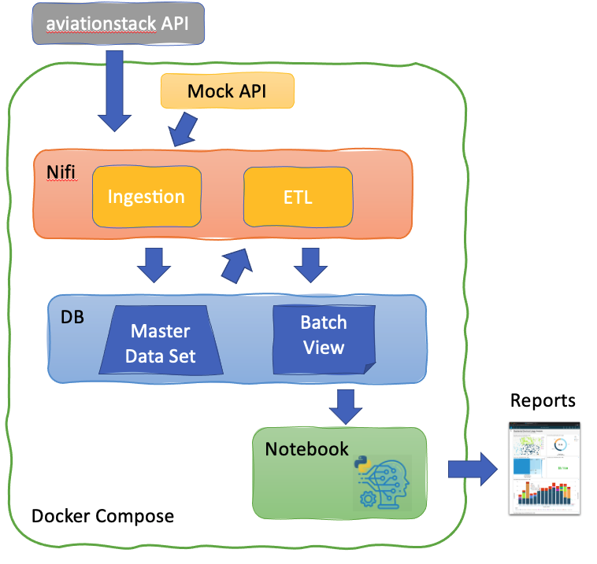

# Mini Take-Home Project

## Objective

Create a datapipe using NIFI, which allows the ingestion of data from aviationstack api, instantiate a master data set (fact model), and creating a view of data of simple transformation,. The services will be instantiated with docker-compose.

## Conceptual View



## Service Instaciated

    * postgress
      * Master Data Set
      * Batch Views
    * nifi
      * Ingestion Processor
      * ETL Batch Process
    * api (mock data)
      * Emulated AviatioStack API
    * notebook
      * Jupyter Notebook

* Create a process in [Nifi] that allows obtaining the information from the API.
  * Aviation Data Flows
    * Ingestion Phase
      * Get Data from [AviationStack] API
      * Insert the information in the database (Postgres) Master Set
    * ETL on Batch Processing
      * Replace the "/" of the arrivalTerminal and departureTimezone fields for " - ". E.g: "Asia/Shanghai" to "Asia - Shanghai"
      * Insert the information in the database (Postgres).
* Create a Jupyter notebook to consume the information stored in the database.
  * Instantiated as service, with avstackhelper libs at python path.
  * Showcase how use Pandas dataframe to retrieve data from pandas
* Master Data Set:
  * Dataset will ever-growing list, immutable, atomic facts

## What I Learn?

- [Nifi] is a powerfull tool for distribute data, although I not sure if I will choose for production.
- Connect Nifi process to
  - Postgres DB
  - Create a ETL Batch
  **NOTE** Beside the power of the tool, I prefer other tools like airflow, that allow to create DAGs using code rather the UI.
- Note: The maste repository is not appropiate to be mysql for bigdata.
- Interface SQL - Pandas


## Background

### Real-time Flight Status

The [AviationStack] API was built to provide a simple way of accessing global aviation data for real-time and historical flights as well as allow customers to tap into an extensive data set of airline routes and other up-to-date aviation-related information. Requests to the REST API are made using a straightforward HTTP GET URL structure and responses are provided in lightweight JSON format. The objective of this project is to construct an ETL for a client in order to query information from the API, clean it, and store the results into a consumable database.

### Nifi

An easy to use, powerful, and reliable system to process and distribute data. Apache [NiFi] supports powerful and scalable directed graphs of data routing, transformation, and system mediation logic.

### FastAPI

[FastAPI](https://fastapi.tiangolo.com/) is a modern, fast (high-performance), web framework for building APIs with Python 3.6+.


### Jupyter Notebooks

The [notebook](https://jupyter-notebook.readthedocs.io/en/stable/notebook.html) extends the console-based approach to interactive computing in a qualitatively new direction, providing a web-based application suitable for capturing the whole computation process: developing, documenting, and executing code, as well as communicating the results
## Requirements

* Docker: [how to install](https://docs.docker.com/get-docker/)
  * Docker-Compose: [how to install](https://docs.docker.com/compose/install/)
* Docker Hub Images:
  * [apache/nifi](https://hub.docker.com/r/apache/nifi/)
  * [postgres](https://hub.docker.com/_/postgres)
  * [fastApi](https://hub.docker.com/r/tiangolo/uvicorn-gunicorn-fastapi)
* Python 3.*
* JDBC PostgresSQL Driver:
  * Driver required to be provisioned to NIFI instanciances, allowing to connect to progres database
  * [postgresql-42.2.18.jar](https://jdbc.postgresql.org/download.html)
## Environment

*Folder: docker-aviationstak*

* It is based on docker images orchestrated by docker-compose

## Build the Notebook image

```bash
docker-compose -f docker-aviationstak/docker-composer.ym build
```

## Start Services

```bash
docker-compose -f docker-aviationstak/docker-composer.ym -d up
```

## Links

* NIFI UI:
  * http://127.0.0.1:8080/nifi

* Aviation Notebook:
  * http://127.0.0.1:8001

NOTE: **Neigther password nor token** is require to access to eigther [NIFI UI] or [Aviation Notebook]

### Configuration

Since this is conceptual approach, it will be require to enter to NIFI [UI] and configure the following *Parameter Contexts* of **Aviation Data Flow** Nifi Group Process

* [AviationStack] Api Key
* [AviationStack] EndPoint URL
  * According the type of account could be set https or http
    * *http://api.aviationstack.com/v1/flight*
  * For testing purpose, it is possible to configure with testing api
    * *http://aviationstack_api/v1/flight*

  1. Go to Menu -> Parameter Contexts
    . Edit ingestionDataCtx Parameter
      . Edit the aviationstack_access_key
      . Edit viationstack_access_key

[AviationStack]: https://aviationstack.com/
[Nifi]: https://nifi.apache.org/
[NIFI UI]:http://127.0.0.1:8080/nifi
[Aviation Notebook]: http://127.0.0.1:8001